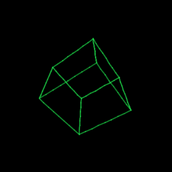
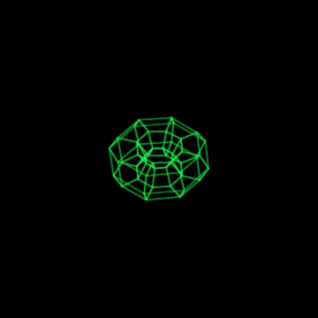
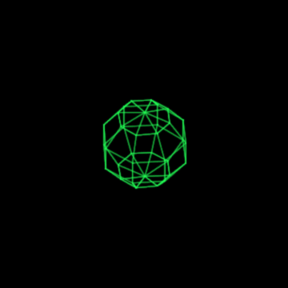
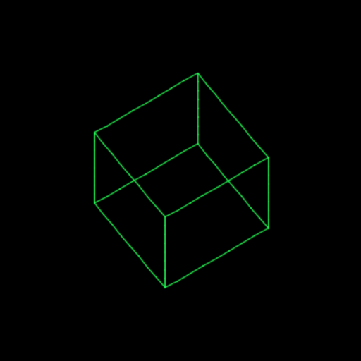
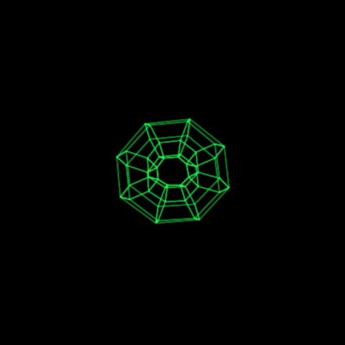
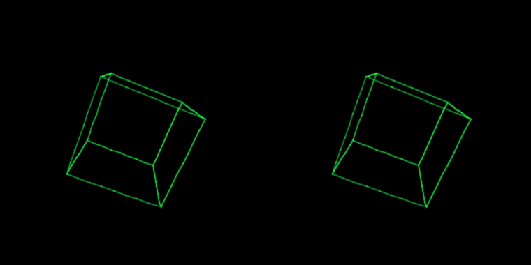

# Philips MC6400 Vector Graphics

**Real-time 3-D wireframe vector graphics — a rotating cube, torus, and sphere —
drawn on an X-Y oscilloscope, computed live in INS8070 machine code on a 1984
Philips MC6400 "MasterLab" CPU trainer.**

The MasterLab has a 1 MHz [National INS8070](https://en.wikipedia.org/wiki/National_Semiconductor_SC/MP)
(SC/MP III) CPU and **1 KB of RAM**. With a small home-made R-2R DAC on its
expansion bus, it drives a scope in X-Y mode and tumbles wireframe solids in
real time — perspective projection, hardware-multiply rotation, and interactive
hex-pad control, all in well under a kilobyte of code.

Programs are loaded onto the machine with
**[PicoRAM Ultimate](https://github.com/lambdamikel/picoram-ultimate)** — a
Raspberry Pi Pico-based (S)RAM/ROM emulator and SD-card interface for vintage
single-board computers and CPU trainers, including the MC6400.

As far as I know this is the **first expansion-port peripheral ever built for the
MasterLab**.

> **How this was made.** Every line of code, all of the tooling (the INS8070
> assembler, cycle-accurate simulator, and oscilloscope renderer), all of the
> assembly programs, and the R-2R DAC hardware design in this repository were
> written by **Claude Code (Claude Opus 4.8)**, working under my direction. I
> (Michael Wessel) supplied the hardware, the MC6400 manual and INS8070
> references, the goals and design choices, and the testing and feedback at each
> step — Claude did the implementation, from the assembler all the way to the
> rotating sphere.

<p align="center">
  
  
  
</p>

*(These are renders from the cycle-accurate simulator, modelling the analog
oscilloscope beam. They are produced by the exact byte stream the real CPU sends
to the DAC.)*

---

## Status: runs on real hardware via PicoRAM; DAC not yet built

**Confirmed on a real Philips MC6400 (loaded via [PicoRAM Ultimate](https://github.com/lambdamikel/picoram-ultimate)):**
the programs run on actual hardware — at full speed (the on-board display
heartbeat advances at the expected frame rate) and with no hangs. So the INS8070
machine code, the PicoRAM RAM emulation under this tight all-in-RAM loop, the
program start-up, and the display I/O all work on real silicon, and the
cycle-accurate simulator (validated against the machine's real monitor ROM and a
bit-exact math reference) matches the hardware's behaviour.

**Not yet built: the DAC.** The R-2R DAC is still a paper design — it hasn't been
built, so the actual oscilloscope output hasn't been produced on hardware yet
(the demo GIFs are simulator renders). Things that may need tuning on the first
DAC build:

- **DAC latch timing.** The design latches the data bus on the write-strobe edge;
  the real INS8070 bus setup/hold may need the decode tweaked or a small delay
  added.
- **Analog side.** R-2R resistor matching, op-amp choice/levels, and the extra
  bus loading from the add-on are untested.

Bug reports and fixes from anyone who builds the DAC are very welcome.

**Heartbeat — verify it runs before you build anything.** Every program also
drives the MasterLab's built-in 7-segment display with a single segment that
rotates one step per frame. So you can load a `.RAM` over PicoRAM and confirm the
program is alive — and roughly how fast it's running — from the on-board display
alone, **before building any of the DAC hardware**. Spinning = running; frozen =
crashed/hung. (It uses display digit 0, I/O at `0xFD0x`/`0xFD1x`; it does not
touch the DAC.)

## What's in the box

A complete, self-contained project — built from scratch in Python with no
external assembler or emulator:

| Part | What |
|------|------|
| **`asm/asm8070.py`** | A two-pass **INS8070 assembler** (handles the chip's off-by-one PC, `0xFF00`-page direct addressing, etc.) |
| **`sim/ins8070.py`** | A **cycle-accurate INS8070 simulator** with a virtual DAC + keypad. Validated by running the real MasterLab monitor ROM. |
| **`sim/render.py`** | An **X-Y oscilloscope renderer** — models the analog beam (sub-pixel, intensity ∝ dwell) → PNG/GIF. |
| **`asm/*.asm`** | The demos: cube (ortho / perspective / interactive), torus, sphere. |
| **`tools/gen_obj.py`** | Procedurally generates the torus & sphere meshes → ready-to-assemble `.asm`. |
| **`tools/make_ram.py`** | Exports an assembled binary to PicoRAM `.RAM` format (load from SD card). |
| **`hw/DAC.md`** | Schematic, BOM, and wiring for the **R-2R DAC** that hangs off the expansion bus. |
| **`ram/`** | Pre-built `.RAM` files — drop on an SD card and run. |

## The programs

| `.RAM` | Object | Projection | Interactive | Refresh |
|--------|--------|-----------|-------------|---------|
| `ram/CUBE.RAM` | cube | orthographic | – | ~25 Hz |
| `ram/CUBE_PERSP.RAM` | cube | perspective | – | ~20 Hz |
| `ram/CUBE_KEY.RAM` | cube | perspective | **yes** | ~19 Hz |
| `ram/TORUS.RAM` | torus | orthographic | **yes** | ~9.6 Hz |
| `ram/SPHERE.RAM` | sphere | orthographic | **yes** | ~13 Hz |

Interactive controls (MasterLab green hex keys): **4/6** yaw, **2/8** pitch,
**5** freeze, **0** reset. Control is velocity-based — nudge it and it keeps
spinning on its own.

<p align="center">
  
  
  
</p>

## How it works

**Each frame** the CPU rotates the object's vertices about two axes, projects
them to 2-D, and streams the result to the DAC:

- **Fixed-point rotation** using the INS8070's *unsigned* hardware `MPY` (16×16→32,
  37 cycles) with sign handled by hand, and a 64-entry ×64 sine table. The cube's
  perspective version uses the hardware `DIV` for the perspective divide.
- **The R-2R DAC is double-buffered** (3× 74HC374): writing X loads a holding
  latch, writing Y commits *both* axes on one clock edge — so the beam jumps
  straight to (x, y) instead of stair-stepping.
- **One continuous stroke.** The wireframe is drawn as a single unbroken path
  (a retrace-minimizing route for the cube; an **Eulerian circuit** of the mesh
  for the torus/sphere, which are 4-regular graphs). That means **no beam jumps
  to blank** — so it looks clean on *digital* scopes too (no Z-axis needed), and
  the curved meshes can be drawn by simply streaming vertices and letting the
  beam connect them.

There are two fun INS8070 gotchas documented in the code: **`A` is the low byte
of `EA`** (so `LD A` silently clobbers a 16-bit result), and the double-buffering
trick above (without it the beam draws L-shaped jogs between points).

## How it was built — the development pipeline

There was no INS8070 assembler or emulator on hand, and no way to *see* the
oscilloscope output without hardware. So the whole thing was bootstrapped in
Python and developed in a tight **assemble → simulate → render → inspect** loop —
every feature was verified as an image on a virtual scope before any hardware
existed.

```
   asm/*.asm ──[asm8070.py]──▶ bytes ──[ins8070.py sim]──▶ (X,Y) DAC stream
       ▲                                                          │
       │                                                    [render.py]
       └────────── inspect · diagnose · fix ◀── PNG / GIF ◀───────┘

   bytes ──[make_ram.py]──▶ .RAM ──▶ PicoRAM SD card ──▶ real MC6400 ──▶ scope
```

**1. Reverse-engineering the machine.** The CPU (INS8070), clock (1 MHz), memory
map (ROM `0x0000–0x0FFF`, RAM `0x1000–0x13FF`, on-board I/O `0xFD0x`, fast
internal RAM `0xFFC0–0xFFFF`), and the expansion-bus pinout were pieced together
from the MC6400 manual, the INS8070 datasheets, and — invaluably — Thorsten
Brehm's emulator source. The unused `0xE000` block was chosen for the DAC.

**2. A from-scratch toolchain.** Three Python tools, none pre-existing: the
[assembler](asm/asm8070.py) (exploits the regular opcode structure and encodes
the INS8070's off-by-one program counter), the [simulator](sim/ins8070.py)
(cycle-accurate, with a virtual DAC and keypad), and the
[renderer](sim/render.py) (an analog-beam model → image).

**3. Validation against ground truth.** Trust was earned, not assumed: the
simulator was validated by **running the real MasterLab monitor ROM**, which
reproduced the machine's genuine multiplexed 7-segment display scan; the hardware
`MPY`/`DIV` instructions were unit-tested; and a Python **reference model**
([`cube_ref.py`](tools/cube_ref.py)) of the exact fixed-point math let the on-CPU
projection be checked **bit-for-bit** at every step.

**4. Incremental, visual development.** Each capability was built and *seen*
before the next: a single DAC dot → a line engine → a static baked cube → live
rotation → perspective → keypad control → torus → sphere → speed optimization.
Bugs surfaced on screen and were diagnosed in the simulator — a stray-line glitch
turned out to be a signed-byte overflow in the line engine; a staircase artifact
revealed that the DAC must be **double-buffered** (which then shaped the
hardware); and a projection that collapsed to a point was traced, by
single-stepping the simulator, to the INS8070 quirk that **`A` is the low byte of
`EA`** (so `LD A` was silently clobbering a 16-bit result).

**5. Hardware co-designed in the loop.** Two hardware decisions came straight out
of the simulator: the **double-buffered 3-latch DAC** (so X and Y update on the
same edge), and the **DSO-friendly single-stroke drawing** — verified by
rendering with blanking disabled, which is exactly how a digital scope behaves.

**6. Onto the real machine.** Finished programs are exported to PicoRAM's `.RAM`
format and loaded over SD card — the format itself checked by a round-trip back
through the simulator.

## Build & run

Everything is plain Python 3 + ImageMagick (for rendering). No Node, no `asl`.

```bash
# assemble a program
python3 asm/asm8070.py asm/cube_persp.asm -o build/cube.bin -l

# simulate + render an animated GIF of the scope output
python3 - <<'PY'
import sys; sys.path[:0] = ["sim", "asm"]
from asm8070 import Assembler
from ins8070 import INS8070
import render
code = Assembler().assemble(open("asm/cube_persp.asm").read())[1]
cpu = INS8070(); cpu.load(0x1000, code); cpu.reset(pc=0x1000)
cpu.run(max_steps=4_000_000)
render.render_gif(cpu, "cube.gif", fps=20, max_frames=64)
PY

# (re)generate the torus / sphere mesh
python3 tools/gen_obj.py torus  asm/torus.asm
python3 tools/gen_obj.py sphere asm/sphere.asm

# export to a PicoRAM .RAM file for the real machine
python3 tools/make_ram.py build/cube.bin ram/CUBE_PERSP.RAM
```

On real hardware: load a `.RAM` file via
[PicoRAM Ultimate](https://github.com/lambdamikel/picoram-ultimate) (SD card),
build the [DAC](hw/DAC.md), wire it to the expansion bus, connect to a scope in
X-Y mode, and RUN.

## The hardware

A 2-channel 8-bit **R-2R ladder DAC** on the expansion connector — full details,
schematic, and bill of materials in **[`hw/DAC.md`](hw/DAC.md)**. Decode the
`0xE000` block off the bus, latch the data bus on the write strobe, three
74HC374s for double-buffering, two resistor ladders, two op-amp buffers. Powered
from the bus's +5 V.

## A note on scopes

A true **analog CRT** scope is ideal for this — a real electron beam draws
smooth, bright, continuous vectors with phosphor persistence. A modern **digital
storage scope (DSO)** also works (the demos are designed to be DSO-friendly:
single continuous stroke, no blanking required) — set it to **X-Y mode**, CH1=X
CH2=Y, **DC coupling**, **vectors/trace** (not dots), and **persistence on**.
The output is the same analog X/Y either way; the analog scope just looks nicer.

<p align="center"></p>

## Credits

- The **MasterLab MC6400 emulator** by Thorsten Brehm —
  [ThorstenBr/MasterLab-MC6400](https://github.com/ThorstenBr/MasterLab-MC6400)
  — was the reference for the INS8070 instruction semantics (and a great
  validation oracle). The simulator here is a Python port of that CPU model.
- **PicoRAM Ultimate** — [lambdamikel/picoram-ultimate](https://github.com/lambdamikel/picoram-ultimate)
  — loads these programs into the machine over SD card, and documented the
  expansion-bus pinout.

## License

MIT — see [LICENSE](LICENSE).
