# Philips MC6400 Vector Graphics

**Real-time 3-D wireframe vector graphics — a rotating cube, torus, and sphere —
drawn on an analog X-Y oscilloscope, computed live in INS8070 machine code on a
1984 Philips MC6400 "MasterLab" CPU trainer.**

The MasterLab has a 1 MHz [National INS8070](https://en.wikipedia.org/wiki/National_Semiconductor_SC/MP)
(SC/MP III) CPU and **1 KB of RAM**. With a small home-made **R-2R DAC** on its
expansion bus — plus one tiny analog trick (an [RC slew-limit](#the-one-surprise-you-need-an-rc-slew-limit),
see below) — it drives a scope in X-Y mode and tumbles solid wireframe solids in
real time, all in **well under a kilobyte** of code.

Programs are loaded onto the machine with
**[PicoRAM Ultimate](https://github.com/lambdamikel/picoram-ultimate)** — a
Raspberry Pi Pico-based (S)RAM/ROM emulator and SD-card interface for vintage
single-board computers. As far as I know this is the **first expansion-port
peripheral ever built for the MasterLab**.

<p align="center">
  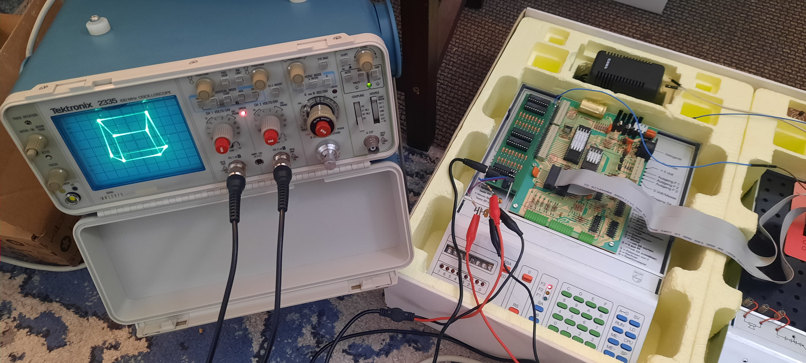
</p>

<p align="center"><em>The full rig: a Philips MC6400 with the home-made R-2R DAC on its
expansion bus (right), driving a Tektronix 2335 analog oscilloscope in X-Y mode (left) —
drawing a solid, rotating 3-D cube. Everything runs live in under 1 KB.</em></p>

<p align="center">
  <a href="https://youtu.be/bAo9eb0MnI4">
    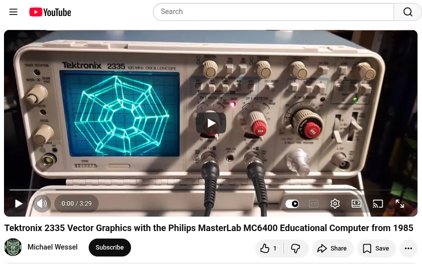
  </a>
</p>

<p align="center"><em>▶ <b><a href="https://youtu.be/bAo9eb0MnI4">Watch the demo on YouTube</a></b> —
the MC6400 tumbling solid 3-D wireframes live on the Tektronix 2335.</em></p>

> **How this was made.** Every line of code, all of the tooling (the INS8070
> assembler, cycle-accurate simulator, and oscilloscope renderer), all of the
> assembly programs, and the R-2R DAC hardware design in this repository were
> written by **Claude (Anthropic, Opus 4.8)** working under my direction, from
> the assembler all the way to the rotating sphere and the on-hardware bring-up.
> I (Michael Wessel) supplied the hardware, the MC6400 manual and INS8070
> references, the goals and design choices, and — crucially for this project —
> the **testing and feedback on the real scope at every step**.

---

## Status: built and running on real hardware ✅

The R-2R DAC is **built and verified on a real Philips MC6400**, driving a
**Tektronix 2335 analog oscilloscope**. It draws **solid, continuously-rotating
3-D vector wireframes** — cube, torus, and sphere — live, in under 1 KB of
INS8070 machine code each. The photos below are the real scope, not renders.

<p align="center">
  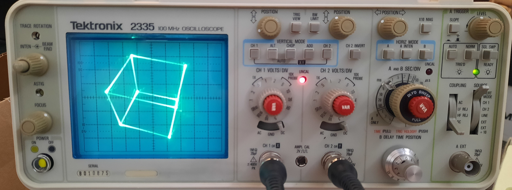
  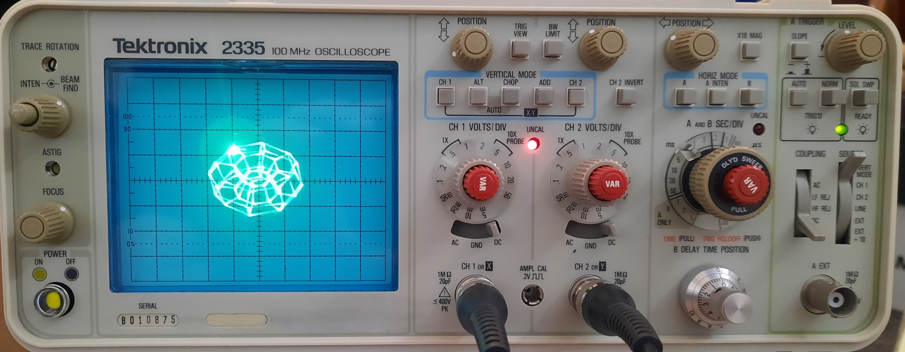
  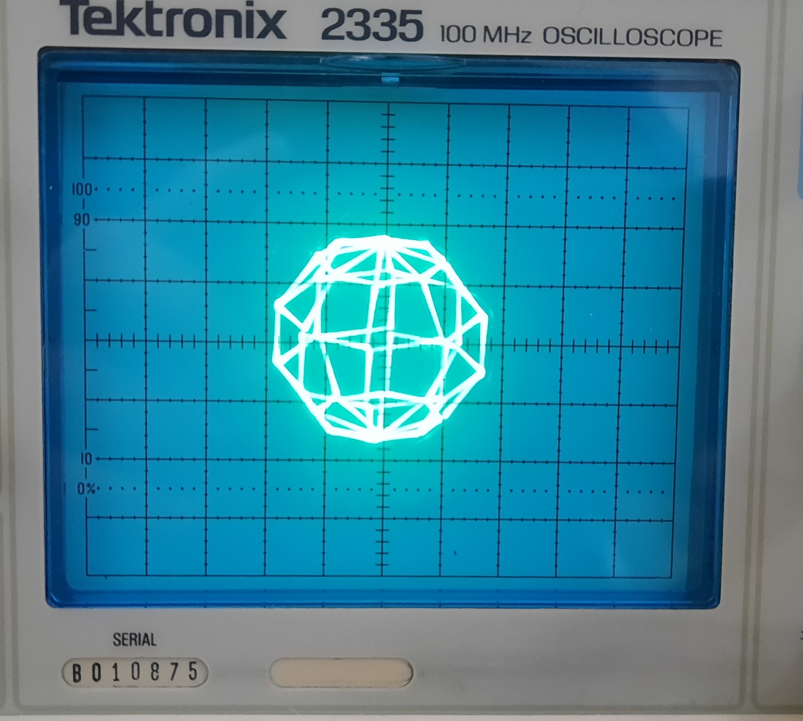
</p>
<p align="center"><em>Cube, torus, and sphere — solid analog vectors on a Tektronix 2335,
computed and streamed live by the MC6400.</em></p>

---

## The one surprise: you need an RC slew-limit

Getting from "it runs" to "you can see vectors" turned out to be the whole story
of the hardware bring-up, and it's worth documenting because it is **not
obvious** and it bites everyone the first time.

**The problem — dots, not lines.** The DAC is a *step* DAC. Writing a new (X, Y)
makes the op-amp jump to the new voltage in a few microseconds; the CPU then
parks there ~100–200 µs while it computes the next point. So the beam spends
almost all of its time sitting on the **vertices** (bright dots) and only
microseconds sliding between them (near-invisible). Out of the box you get a
recognisable but **dotted** figure — never solid lines — no matter how you set up
the scope. Cranking the intensity just blooms the dots.

**Why the scope's own "vectors" don't save you.** An *analog* scope has no
"vector mode" — its beam is always drawing wherever X,Y are; the issue is purely
that it flies between points too fast to light them. A *digital storage scope*
does have a "Display Vectors" option, but in X-Y it connects consecutive
*samples in acquisition order*, sampled asynchronously to the DAC with a
bandwidth-limited horizontal channel — so DSOs are simply poor X-Y vector
monitors (see [Scopes](#scopes-use-an-analog-crt)). We chased this for a while
before realising it's fundamental.

**The fix — draw the lines in hardware.** Real vector displays (Vectrex,
Asteroids, Tektronix storage tubes) move the beam at a *constant velocity*
between endpoints so the whole line lights evenly. You can approximate that on
this DAC with a two-part, reversible add-on: **slew-limit each output with an RC
low-pass**, so every DAC *step* becomes a *ramp*. The beam then sweeps
continuously along each edge — the dots merge into **solid, uniform-brightness
vectors** — and the CPU only has to output the wireframe **endpoints**.

```
 MCP6002 OUT ──[ R ]──┬──► scope CH1 / CH2
                      │
                     [ C ]
                      │
                     GND
```

- **R = 4.7 kΩ, C ≈ 15 nF** (τ ≈ 70 µs). We used 10 nF ∥ 4.7 nF = 14.7 nF.
  τ ≈ 50–80 µs is the sweet spot — tune by eye.
- **Match X and Y** (same R, same C) or diagonals bow into curves.
- Too much C rounds corners / shrinks the figure; too little stays dotty.

Full details and the tuning rationale are in **[`hw/DAC.md`](hw/DAC.md)**.

<p align="center">
  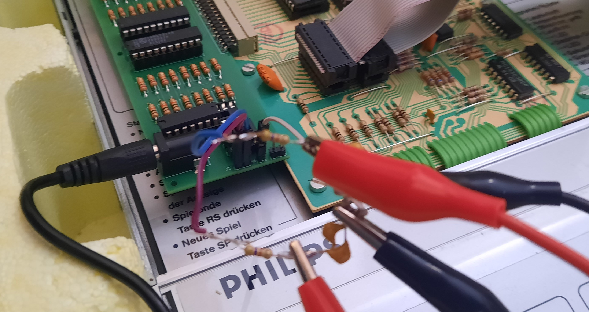
</p>
<p align="center"><em>The whole fix: a series resistor and a shunt capacitor per axis,
tacked onto the DAC's output header. Dots → solid vectors.</em></p>

The software side is matched to this: the programs stream **only the wireframe
endpoints** and dwell ~2–3 τ per point so the ramp just reaches each corner
before the beam moves on.

---

## Scopes: use an analog CRT

**Use a true analog oscilloscope.** We built and tested this on a **Tektronix
2335** (a lovely 100 MHz analog scope), and that is what we recommend. On an
analog CRT the electron beam draws smooth, bright, continuous vectors, and with
the RC slew-limit in place the result is genuinely beautiful.

**A digital storage scope (DSO) is *not* recommended** for this. Despite the
common assumption (which this project's earlier notes shared, and which turned
out to be wrong), DSOs do a poor job of X-Y *vector* display: they store and
plot sample points, their "vectors/interpolation" connects samples in time-order
rather than following the analog beam path, and their horizontal channel is
second-class. Some DSOs with **infinite/auto persistence** will *accumulate* the
dots into a filled figure over many frames — so you may see *something* — but it
won't look like a real vector display, and it defeats the point.

**Analog X-Y setup (Tek 2335 and similar):** CH1 = X, CH2 = Y; press the CH1 and
CH2 vertical-mode buttons together for **X-Y mode**; **DC coupling** on both;
start ~0.5–1 V/div and centre with the position knobs; keep intensity moderate,
then adjust focus/astigmatism.

---

## The programs

The current, hardware-tested set — each is a **standalone, auto-rotating**
1 KB program:

| `.RAM` | Object | Size | What |
|--------|--------|-----:|------|
| [`ram/CUBE.RAM`](ram/CUBE.RAM) | perspective cube | 701 B | 8 vertices, 12 edges, perspective projection |
| [`ram/TORUS.RAM`](ram/TORUS.RAM) | torus | 773 B | wireframe mesh, streamed as one continuous route |
| [`ram/SPHERE.RAM`](ram/SPHERE.RAM) | sphere | 683 B | wireframe mesh, streamed as one continuous route |

Sources are [`asm/cube.asm`](asm/cube.asm), [`asm/torus.asm`](asm/torus.asm),
[`asm/sphere.asm`](asm/sphere.asm). Each rotates automatically about two axes;
there is no keypad control in *this* set — for a fully **interactive** program on
the same pipeline, see [The shooter](#the-shooter--a-playable-vector-game).

### Heartbeat — the front panel stays alive

Each program marches a lit LED across the MasterLab's **F1 → F2 → F3** front-panel
LEDs, one step per frame, as an "it's alive / this fast" indicator (~0.3 Hz on
the cube). These are the INS8070's **status-register flag outputs** (they latch —
no display multiplexing needed), so the heartbeat costs nothing and doesn't touch
the DAC or the beam. Marching = running; frozen = crashed.

> A note on the display: an earlier heartbeat drove the 8-digit 7-segment
> display, but that display is **multiplexed** (it needs continuous scanning to
> stay lit) and can't be driven from a once-per-frame write without stealing beam
> time — so the F1/F2/F3 status LEDs are the clean choice.

---

## The shooter — a playable vector game

The cube/torus/sphere prove the display can *draw*; this proves it can **play**.
[`asm/shooter.asm`](asm/shooter.asm) is a small Space-Invaders-style **vector
game** — a turret, a descending grid of hexagon "aliens", and a bullet — running
on the same endpoints-only + RC pipeline, the whole thing in **under 1 KB**.

<p align="center">
  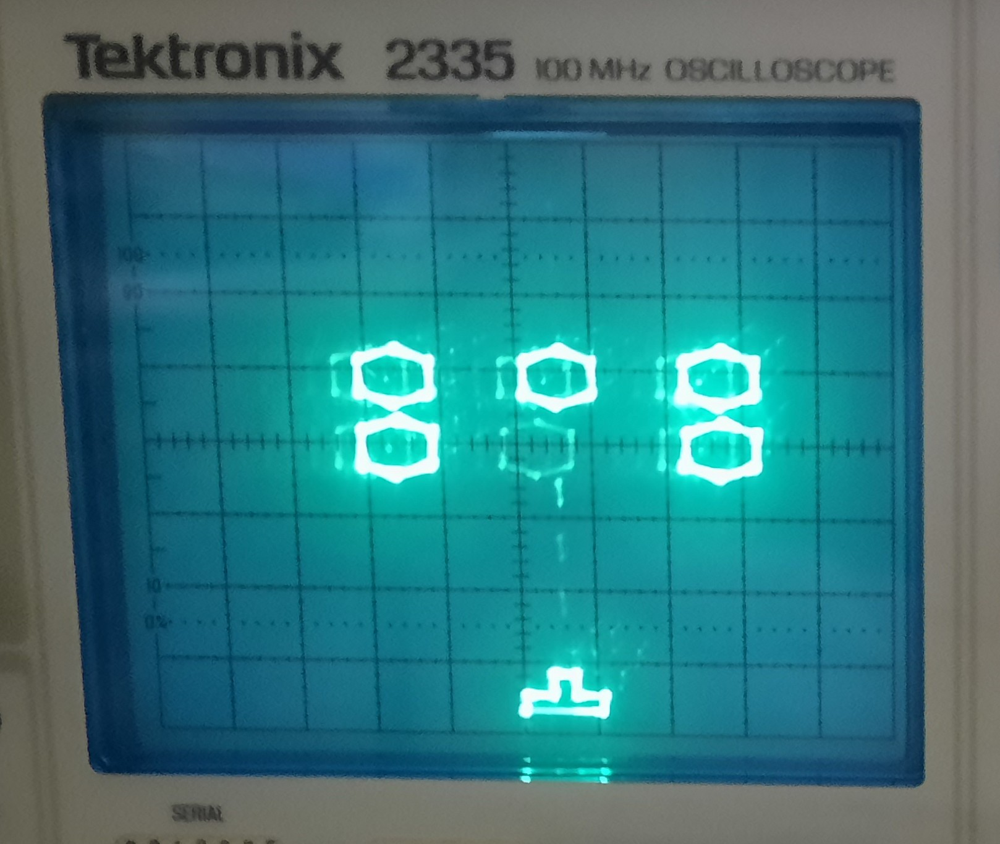
  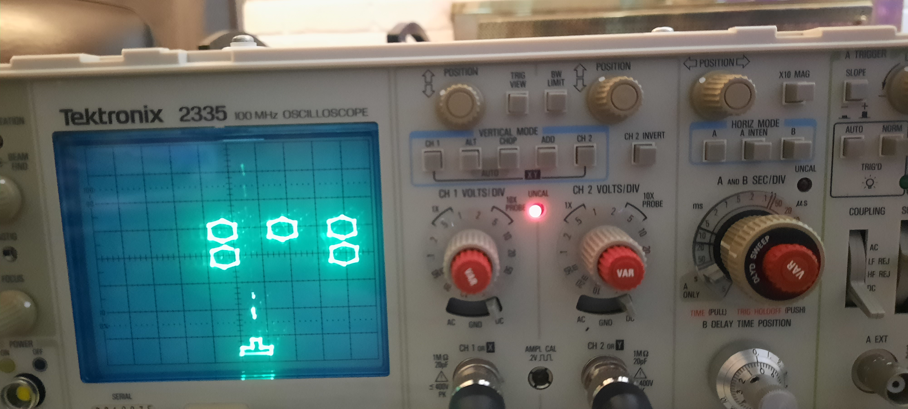
</p>
<p align="center"><em>Running on the real Tektronix 2335: the full wave (left), and mid-game — a
column cleared and a bullet in flight (right).</em></p>

<p align="center">
  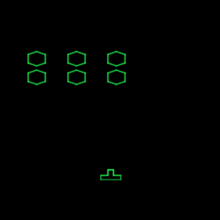
</p>

**Controls — two input paths, live at the same time:**

- **Keypad:** `4` = left, `6` = right, `0` = fire.
- **Console buttons:** `SA` = left, `SB` = right, `SA + SB` together = fire.

The dual scheme is for the exhibit: rather than let visitors poke the machine's
keypad, wire **three arcade buttons** to the `4`/`6`/`0` pads — *or* two big
buttons to `SA`/`SB` — and the same ROM just works. (`SA`/`SB` are the INS8070's
sense inputs, read straight from the status register.)

**On-panel / on-screen feedback:**

- The **F1 / F2 / F3** front-panel LEDs show an *aliens-remaining* bar as you play.
- Clear the wave and a big **"WIN"** flashes in vectors; get overrun and a big
  **"X"** flashes — then the next wave drops in automatically.

<p align="center">
  
  &nbsp;&nbsp;&nbsp;
  
</p>

**Pick a variant.** Wave size and speed are baked in at build time, so each
combination is its own standalone 1 KB `.RAM` — load whichever suits the moment:

| Aliens ↓ \ Speed → | Slow | Medium | Fast |
|---|---|---|---|
| **3** | [`SHOOTER_3_SLOW`](ram/SHOOTER_3_SLOW.RAM) | [`SHOOTER_3_MED`](ram/SHOOTER_3_MED.RAM) | [`SHOOTER_3_FAST`](ram/SHOOTER_3_FAST.RAM) |
| **6** | [`SHOOTER_6_SLOW`](ram/SHOOTER_6_SLOW.RAM) | [`SHOOTER_6_MED`](ram/SHOOTER_6_MED.RAM) | [`SHOOTER_6_FAST`](ram/SHOOTER_6_FAST.RAM) |
| **9** | [`SHOOTER_9_SLOW`](ram/SHOOTER_9_SLOW.RAM) | [`SHOOTER_9_MED`](ram/SHOOTER_9_MED.RAM) | [`SHOOTER_9_FAST`](ram/SHOOTER_9_FAST.RAM) |

[`ram/SHOOTER.RAM`](ram/SHOOTER.RAM) is the default (6 aliens, medium).

The **3- and 6-alien builds ramp up**: each cleared wave descends a little faster,
and a loss resets it to the base speed. The **9-alien builds stay constant** — a
full grid is already plenty — so there the difficulty is the sheer count.

**Implementation notes** (all in [`asm/shooter.asm`](asm/shooter.asm)):

- Each object is drawn **endpoints-only** with a **Z-blank** between objects, so
  the beam doesn't streak from one sprite to the next (unlike the single-stroke
  wireframes above, these are separate figures).
- Collisions are an **unsigned bounding-box** test done entirely with the carry
  flag — INS8070 branches test `A`, so an unsigned compare is
  `SUB; LD A,S; AND =0x80`.
- The lose test scans for the **lowest still-*living*** alien, not the
  formation's nominal bottom row, so a *killed* alien's empty slot can't "reach"
  you and end the game.
- **Refresh is decoupled from game logic** (several redraws per logic tick) to
  keep the short-persistence phosphor bright while the game updates at a playable
  rate — the same flicker/refresh trick used by the wireframe demos.

> Developed and **played on the real MC6400 + Tektronix analog scope**; keypad and
> SA/SB control are both confirmed on hardware.

---

## How it works

**Each frame** the CPU rotates the object's vertices about two axes, projects
them to 2-D, and streams the wireframe **endpoints** to the DAC; the analog RC
draws the edges between them.

- **Endpoints-only, RC-drawn lines.** The CPU emits only the vertices of the
  wireframe; the [RC slew-limit](#the-one-surprise-you-need-an-rc-slew-limit) on
  the outputs turns each jump into a continuously-drawn line. The per-vertex
  dwell is tuned to the RC time constant so the beam just reaches each corner.
- **One continuous stroke.** The wireframe is drawn as a single unbroken path
  (a retrace-minimising route for the cube; an **Eulerian circuit** of the mesh
  for the torus/sphere, which are 4-regular graphs). The pen never lifts — no
  wasted retrace lines, no Z-blanking needed.
- **Double-buffered DAC** (3× 74HC374): writing X loads a holding latch, writing
  Y commits *both* axes on one clock edge — so the beam moves in a straight
  diagonal to (x, y) instead of an L-shaped staircase.
- **Fixed-point rotation** using the INS8070's *unsigned* hardware `MPY`
  (16×16→32) with sign handled by hand, and a 64-entry ×64 sine table. The
  cube's perspective divide uses the hardware `DIV`.

Two INS8070 gotchas are documented in the code: **`A` is the low byte of `EA`**
(so `LD A` silently clobbers a 16-bit result), and the double-buffering trick
above (without it the beam draws L-shaped jogs between points).

---

## The toolchain (all from scratch, in Python)

There was no INS8070 assembler or emulator on hand, and — at first — no way to
*see* oscilloscope output without hardware. So the whole thing was bootstrapped
in Python and developed in a tight **assemble → simulate → render → inspect**
loop, then finished on real hardware.

| Part | What |
|------|------|
| [`asm/asm8070.py`](asm/asm8070.py) | Two-pass **INS8070 assembler** (handles the chip's off-by-one PC, `0xFF00`-page direct addressing, etc.) |
| [`sim/ins8070.py`](sim/ins8070.py) | **Cycle-accurate INS8070 simulator** with a virtual DAC + keypad. Validated by running the real MasterLab monitor ROM. |
| [`sim/render.py`](sim/render.py) | **X-Y oscilloscope renderer** — models the analog beam (sub-pixel, intensity ∝ dwell) → PNG/GIF. |
| [`tools/gen_obj.py`](tools/gen_obj.py) | Procedurally generates the torus & sphere meshes → ready-to-assemble `.asm`. |
| [`tools/make_ram.py`](tools/make_ram.py) | Exports an assembled binary to PicoRAM `.RAM` format (load from SD card). |
| [`hw/DAC.md`](hw/DAC.md) | Schematic, BOM, wiring, and the **RC slew-limit** for the R-2R DAC. |

The simulator was validated against ground truth by **running the real MasterLab
monitor ROM** (reproducing its multiplexed 7-segment scan); the `MPY`/`DIV`
instructions were unit-tested; and a Python reference model checked the on-CPU
fixed-point projection **bit-for-bit**. The simulator renders below are produced
from the exact byte stream the real CPU sends to the DAC:

<p align="center">
  
  
  
</p>

---

## Build & run

Plain Python 3 + ImageMagick (for rendering). No external assembler or emulator.

```bash
# assemble a program
python3 asm/asm8070.py asm/cube.asm -o build/cube.bin -l

# export to a PicoRAM .RAM file for the real machine
python3 tools/make_ram.py build/cube.bin ram/CUBE.RAM

# simulate + render a GIF of the scope output (optional, no hardware needed)
python3 - <<'PY'
import sys; sys.path[:0] = ["sim", "asm"]
from asm8070 import Assembler
from ins8070 import INS8070
import render
code = Assembler().assemble(open("asm/cube.asm").read())[1]
cpu = INS8070(); cpu.load(0x1000, code); cpu.reset(pc=0x1000)
cpu.run(max_steps=4_000_000)
render.render_gif(cpu, "cube.gif", fps=20, max_frames=64)
PY
```

**On real hardware:**

1. Build the **[R-2R DAC](hw/DAC.md)** and add the **RC slew-limit** on the X/Y
   outputs (matched R/C).
2. Load a `.RAM` file via **[PicoRAM Ultimate](https://github.com/lambdamikel/picoram-ultimate)**
   (SD card) and **RUN** — confirm the F1/F2/F3 heartbeat marches.
3. Wire the DAC's X/Y to an **analog scope** in **X-Y mode**, DC-coupled; centre
   and size with the position/gain knobs. Enjoy the vectors.

<p align="center">
  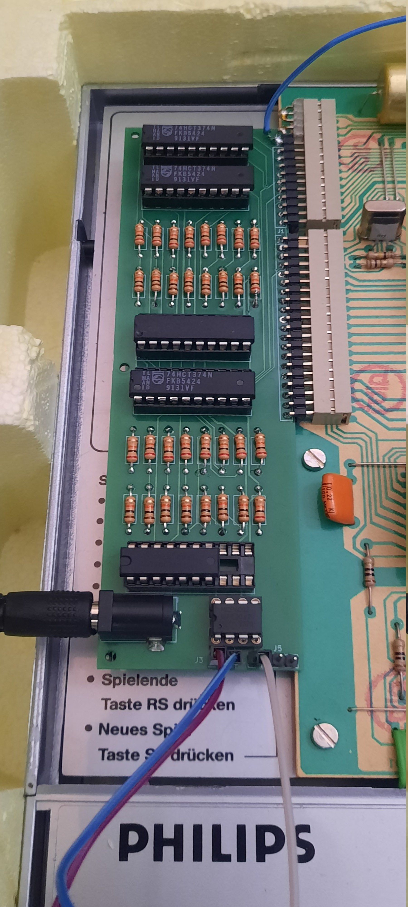
  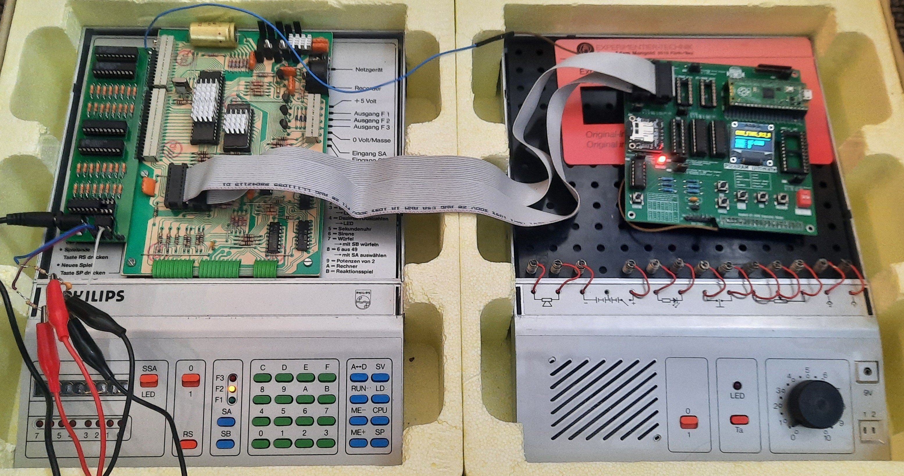
</p>
<p align="center"><em>Left: the built DAC — three 74HCT374 latches, two R-2R ladders, the
address-decode GAL, and an MCP6002 output buffer, on the expansion connector. Right: the
bring-up setup.</em></p>

---

## Roadmap

- **Interactive control — done for the game** ([The shooter](#the-shooter--a-playable-vector-game): keypad + SA/SB). Still to do: live hex-keypad control
  (yaw/pitch/zoom/freeze) of the rotating wireframes.
- ~~A per-wave difficulty ramp for the shooter~~ — **done** (3- and 6-alien builds:
  descent speeds up each cleared wave, resets on a loss).
- More objects and per-object tuning; optional Z-blank for scopes that have a Z
  input.

---

## Credits & acknowledgements

- **[PicoRAM Ultimate](https://github.com/lambdamikel/picoram-ultimate)** loads
  these programs into the machine over SD card, and documented the expansion-bus
  pinout.
- The **[MasterLab MC6400 emulator](https://github.com/ThorstenBr/MasterLab-MC6400)**
  by Thorsten Brehm was the reference for the INS8070 instruction semantics and a
  great validation oracle; the simulator here is a Python port of that CPU model.
- During the hardware bring-up, various scope-specific program variants were
  explored (including some generated with OpenAI's GPT) while we worked out why
  the display was dotted. Those experiments helped pin down the problem, but the
  programs shipped here are the clean, unified solution: **endpoints-only drawing
  + an RC slew-limit on the DAC**, tested on the real analog scope.

## License

MIT — see [LICENSE](LICENSE).
