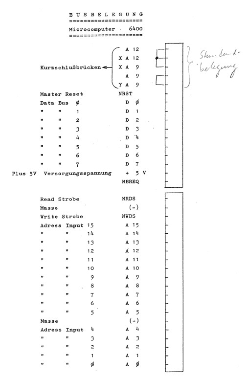

# MC6400 MasterLab — X-Y Oscilloscope DAC (expansion-bus add-on)

A small, double-buffered **2-channel 8-bit R-2R DAC** that hangs off the
MC6400 expansion connector ("BUSBELEGUNG") and drives an oscilloscope in X-Y
(vector) mode.  The INS8070 writes X then Y as memory-mapped I/O; the beam
jumps straight to the new point and the scope's analog sweep draws the lines.

This is the companion hardware for the demos.  It is the first known
expansion-port peripheral for the MasterLab, so the address map below is *our*
choice — nothing on the stock machine uses the `0xE000` block.

> **Status:** this is a *paper design* — it has not been built or tested on real
> hardware yet. It was designed alongside the cycle-accurate simulator, which
> models the double-buffered behaviour exactly, but expect to tune timing/levels
> on first build.

## For a digital scope (e.g. Hantek DSO5072P)

This DAC is a plain analog X/Y source, so **it works with your DSO** — the two
channels go to CH1 (X) and CH2 (Y) in X-Y mode. Two notes:

- **Build the X and Y channels only; skip the optional Z-blank flip-flop
  (74HC74).** A DSO has no Z/intensity input, and you don't need one: all the
  demo programs draw the wireframe as a single continuous stroke (Eulerian
  route / retrace-over-existing-edges), so there are no beam jumps to blank.
- **The double-buffering (the three 74HC374s) is still required** — it makes X
  and Y update on the same edge so the beam moves in straight diagonals.

DSO setup: X-Y mode, CH1=X CH2=Y, **DC coupling**, display set to **Vectors**
(not Dots), **persistence on**, and timebase set so one frame (~50–100 ms) fits
the capture window. Adjust V/div + position to fill the screen. The hardware is
correct/compatible regardless; how smooth it *looks* depends on the DSO's X-Y
refresh — an analog CRT scope would look nicer, but is not required.

## Block diagram

```
  Bus signals               Address decode  (74LS04 + 74LS21 + 74LS138)
  -----------               ----------------------------------------------
  A12 A13 A14 A15  ----->    BLKSEL = A15 & A14 & A13 & !A12
  A0  A1           ----->    74LS138 select inputs
  NWDS (write)     ----->    74LS138 enable = BLKSEL & NWDS
                                |
                                +--> XCLK    write 0xE000
                                +--> YCLK    write 0xE001  (commit)
                                +--> ZCLK    write 0xE002  (optional Z-blank)

  Data path  (X-out and Y-out are BOTH clocked by YCLK, so X and Y update together)

  D0..D7 --+--> [ X-hold 74HC374 ] --Q--> [ X-out 74HC374 ] --Q--> [ R-2R X ] --> op-amp --> CH1 (X)
           |         clk = XCLK                clk = YCLK
           |
           +------------------------------> [ Y-out 74HC374 ] --Q--> [ R-2R Y ] --> op-amp --> CH2 (Y)
                                                 clk = YCLK
```

## Address map (our decode)

| Address | Write does | Clocks |
|---------|-----------|--------|
| `0xE000` | load X into holding latch (beam does NOT move) | X-hold (74HC374 #1) |
| `0xE001` | **commit**: X-out ← X-hold and Y-out ← data, simultaneously | X-out (#2) + Y-out (#3) |
| `0xE002` | Z / beam-blank bit (optional) | Z flip-flop (74HC74) |

The program always writes **X first, then Y**; the Y write commits both axes at
once so the beam moves in a straight diagonal (no L-shaped staircase).  Only
`A15..A12` and `A1,A0` are decoded, so the whole `0xE000–0xEFFF` block aliases
to these few registers — harmless, since nothing else lives there.

## Why double-buffered (3 latches, not 2)

With two independent latches the beam visibly jogs horizontally then vertically
between every point (X updates before Y).  The X-holding latch + a common
commit strobe make X and Y update on the same clock edge, giving clean vectors.
Verified in the simulator (`sim/ins8070.py` models exactly this).

## The R-2R ladder (one per channel)

Each 74HC374 output bit drives the ladder rail-to-rail (0 V / +5 V). Standard
8-bit voltage-mode R-2R, with **R = 10 kΩ** and **2R = 20 kΩ**:

```
   Vout (MSB node)
    |
    +--[R]--+--[R]--+--[R]--+--[R]--+--[R]--+--[R]--+--[R]--+--[2R]--GND
    |       |       |       |       |       |       |       |
   [2R]    [2R]    [2R]    [2R]    [2R]    [2R]    [2R]    [2R]
    |       |       |       |       |       |       |       |
    D7      D6      D5      D4      D3      D2      D1      D0
   (MSB)                                                   (LSB)

   Vout --> op-amp unity-gain buffer (e.g. MCP6002) --> scope X (or Y), ~0..5 V
```

The **X-out** latch's `Q` outputs feed the X ladder; the **Y-out** latch
(clocked by the same `0xE001` commit strobe, but with its `D` inputs taken
straight from the data bus) feeds the Y ladder. So on the commit write, X-out
latches the held X value and Y-out latches the current bus value (Y) — both on
one edge. Use **0.1 % resistors (or a matched network)** for a monotonic 8-bit
ladder.

## Op-amp buffer (MCP6002)

Each ladder node is high-impedance (and code-dependent), so it can't drive the
scope directly — buffer each channel with one half of the **MCP6002** as a
**unity-gain follower**. Rail-to-rail is essential here: on the single +5 V
supply the signal swings right up to both rails, and the MCP6002's inputs *and*
outputs both reach rail-to-rail (a plain single-supply op-amp would clip `0x00`
and `0xFF`).

```
          +--\/--+
   OUTA  1|      |8  VDD  (+5 V)
   INA-  2|      |7  OUTB
   INA+  3|      |6  INB-
   VSS   4|      |5  INB+
  (GND)   +------+
```

Per channel it's three connections — `IN+` from the ladder, `OUT` to the scope,
and `OUT` jumpered back to `IN-` (that feedback wire is what makes it unity gain):

| Channel | non-inv input ← ladder | output → scope | tie OUT back to |
|---------|------------------------|----------------|-----------------|
| **X** (op-amp A) | pin 3 (INA+) | pin 1 (OUTA) → CH1 | pin 2 (INA−) |
| **Y** (op-amp B) | pin 5 (INB+) | pin 7 (OUTB) → CH2 | pin 6 (INB−) |

Power: **pin 8 → +5 V**, **pin 4 → GND**, with a 0.1 µF cap across them close to
the chip.

Speed: the MCP6002 (~1 MHz, ~0.6 V/µs) slews a full-scale 0→5 V jump in ~8 µs —
well within the tens of µs the DAC dwells on each point, so it settles fine. For
razor-sharp corners you could drop in a faster rail-to-rail dual (e.g. MCP6022,
~10 MHz, identical pinout).

## Bill of materials

**Common to both decoder options:**

| Qty | Part | Purpose | Notes |
|-----|------|---------|-------|
| 3 | **74HC374** octal D-latch | X-hold, X-out, Y-out | **HC (CMOS)** — clean 0/5 V outputs for ladder accuracy. Not LS here. |
| 1 | MCP6002 (rail-to-rail dual op-amp) | X & Y output buffers | single +5 V; or TL072 with ±supply |
| 32 | resistors **or** 2× 8-bit R-2R network | the two DAC ladders | R=10 kΩ, 2R=20 kΩ. A pre-made R-2R SIP network (e.g. Bourns 4116R-R2R) per channel matches far better and saves wiring. |
| 1 | 74HC74 (optional) | Z/blank flip-flop | only if your scope has a Z (intensity) input |
| — | 0.1 µF decoupling (1 per IC), DIP sockets, ribbon/header to bus | | |

**Decoder — pick one:**

| Option | Parts | Notes |
|--------|-------|-------|
| **A. Single GAL** (simpler) | 1× GAL16V8 / GAL18V10 / GAL22V10 (or ATF equivalent) | One chip does the whole address decode **and** all latch clocks. Program it with [`dac_decode.pld`](dac_decode.pld). **No inverter / AND / '138 needed.** |
| **B. Discrete 74-series** | 1× 74LS138 + 1× 74LS21 (dual 4-input AND) + 1× 74LS04 (hex inverter) | No programmer needed, but three logic chips instead of one. |

Total IC count: **5 with the GAL** (3× '374 + GAL + MCP6002) vs **7 discrete** —
plus the optional '74 if you wire up Z-blank. For the supply, see **Powering the
board** below.

### Reference board (KiCad) — per-refdes BOM

A reference 2-layer KiCad board (GAL-decoder variant) has been laid out and
netlist-checked. Machine-readable: [`masterlab_bom.csv`](masterlab_bom.csv).

| Refs | Qty | Value / Part | Notes |
|------|-----|--------------|-------|
| R1–R16, R17, R25 | 18 | **20 kΩ** (2R) | R-2R bit rungs + the two terminations |
| R18–R24, R26–R32 | 14 | **10 kΩ** (R) | R-2R series links |
| C1–C6 | 6 | 0.1 µF | decoupling, one per IC |
| U1, U2, U3 | 3 | 74HC374 | the latches (HC, not LS) |
| U4 | 1 | **MCP6002** | rail-to-rail dual op-amp — *not* MCP602 (same DIP-8 pinout) |
| U5 | 1 | 74HC74 | Z-blank FF — optional; tie unused pins 11 & 12 to GND |
| U6 | 1 | GAL16V8 | program with [`dac_decode.pld`](dac_decode.pld) (ATF16V8 ok) |
| J1 | 1 | 1×20 header, 2.54 mm | MasterLab **lower** bus strip |
| J2 | 1 | 1×11 header, 2.54 mm | MasterLab **upper** bus strip |
| J3 | 1 | 1×2 header | scope output — pin 1 = X, pin 2 = Y |
| J4 | 1 | DC barrel jack | power input — **5 V only**, center + |
| J5 | 1 | 1×2 header | Z-blank output — pin 1 = Q, pin 2 = /Q (optional) |
| J6 | 1 | 1×1 header | GND reference / scope ground |

Use **0.1 % (or matched) ladder resistors** for a monotonic 8-bit DAC, keeping
the 2R = 2×R ratio. The intentional no-connects (unused bus pins, spare GAL I/O,
the spare '74 half) generate a harmless "single-pad net" warning on export.

## Powering the board

On a real unit the MasterLab's supply is **9 V DC @ 350 mA** (check the brick's
polarity symbol before replacing it), feeding an on-board **7805** that makes the
5 V logic rail — and the expansion-bus **+5 V is that same regulated rail** (a
continuity check, power off, from the bus +5 V pin to the CPU's Vcc pin — or to
the 7805's output pin — confirms it). That 7805 runs hot once PicoRAM and this
DAC share the rail (it burns the 9→5 V drop across the total current), and 350 mA
gets marginal. Three ways to power the DAC:

- **A — from the bus +5 V** (simplest wiring). Fine for a **CMOS-GAL** build
  (~20 mA total). Avoid it with a bipolar GAL (~100 mA) on an already-warm 7805.
- **B — separate regulated +5 V for the DAC** (recommended if the 7805 is hot).
  Feed the DAC's Vcc externally; **drop the bus +5 V wire but keep the bus GND
  wire** — that is the required common ground (the DAC reads the MasterLab's
  logic levels, so the grounds *must* be tied). Use ~5 V to match the MasterLab
  rail (not 3.3 V). **Sequencing:** the DAC's 5 V must be present whenever the
  MasterLab drives the bus into it, or the HC input clamp diodes conduct
  (bus → unpowered Vcc) — use the same power switch, or bring the DAC up first.
- **C — one modern 5 V / ≥2 A supply for everything** (cleanest overall). Inject
  regulated 5 V into the MasterLab's "+5 V / 0 V" rail, retiring the 7805, the
  9 V brick, *and* any mains step-up. Disconnect the 9 V input and lift the 7805
  output (or add a series Schottky) so it isn't back-driven.

The GAL dominates the DAC's current draw: a bipolar GAL16V8/22V10 is ~90–130 mA,
a CMOS ATF16V8/22V10 only ~20 mA — pick CMOS if you'd rather keep the DAC on the
bus rail.

## Decode logic — discrete vs GAL

**Discrete (no programmer needed):**
```
!A12   = 74LS04 inverter
BLKSEL = 74LS21:  A13 & A14 & A15 & !A12
74LS138:  G1 = BLKSEL,  /G2A = NWDS,  /G2B = GND,  A = A0, B = A1, C = GND
          Y0 -> 74HC374 X-hold CLK
          Y1 -> 74HC374 X-out CLK  AND  Y-out CLK   (tie together)
          Y2 -> 74HC74  Z clock (D = D0)
```
A '138 output idles HIGH, pulses LOW during the matching write, and returns
HIGH (rising edge) when `NWDS` releases — that rising edge clocks the '374s,
latching data that is stable through the write.

**GAL (one chip, if you have a programmer).** A complete, ready-to-compile
WinCUPL source is in **[`dac_decode.pld`](dac_decode.pld)** — it targets a
GAL16V8 (universal, known pinout) and produces `XCLK` (0xE000), `YCLK` (0xE001
commit) and an optional `ZCLK` (0xE002). To use a GAL18V10 or 22V10 instead,
keep the equations and just change the device + pin numbers. The core logic:
```
BLOCK = A15 & A14 & A13 & !A12 ;       /* 0xE000-0xEFFF block        */
XCLK  = !(BLOCK & !A1 & !A0 & !NWDS) ; /* 0xE000  -> X-hold          */
YCLK  = !(BLOCK & !A1 &  A0 & !NWDS) ; /* 0xE001  -> X-out + Y-out   */
ZCLK  = !(BLOCK &  A1 & !A0 & !NWDS) ; /* 0xE002  -> optional Z-blank*/
```

## The expansion connector (BUSBELEGUNG)

The full bus pinout, transcribed from the MC6400 manual. Two single-row strips,
standard 2.54 mm (0.1″) pitch (the board side is female sockets). **✔** marks the
signals this DAC taps.



**Upper strip** (top → bottom):

| Signal | Meaning | DAC |
|--------|---------|:---:|
| A12, XA12, XA9, A9, YA9 | address-config shorting jumpers (*Kurzschlußbrücken*; factory "Standardbelegung" — leave as-is) | |
| NRST | Master Reset (active low) | |
| D0 … D7 | data bus | **✔** |
| +5V | supply (*Versorgungsspannung*) | ✔* |
| NBREQ | bus request (active low) | |

**Lower strip** (top → bottom):

| Signal | Meaning | DAC |
|--------|---------|:---:|
| NRDS | read strobe (active low) | |
| GND | ground (*Masse*) | **✔** |
| NWDS | **write strobe** (active low) | **✔** |
| A15 … A5 | address bus | ✔ (A15–A12) |
| GND | ground (*Masse*) | |
| A4 … A0 | address bus | ✔ (A1, A0) |

So the DAC needs **17 signals**: `D0–D7`, `A0`, `A1`, `A12`, `A13`, `A14`, `A15`,
`NWDS`, `+5V`*, `GND`. You do *not* need `NRDS`, `NBREQ`, `NRST`, the config
jumpers, or `A2–A11`.
&nbsp;&nbsp;*`*` `+5V` only if powering the DAC from the bus — otherwise use an
external 5 V and just the bus `GND` (see **Powering the board**).*

Image: from the MC6400 manual, via the
[picoram-ultimate](https://github.com/lambdamikel/picoram-ultimate) repo.

## Output / scope setup

- Each ladder → op-amp **unity follower** → scope X (and Y) input, giving
  ~0–5 V per axis.  Set the scope to **X-Y mode**, DC-coupled, and use the
  position/gain knobs to centre and size the figure.
- For a centred ±2.5 V swing, use the op-amp as a difference amp subtracting a
  2.5 V reference instead of a plain follower.
- **Z/blank (optional):** on a scope with a Z (intensity) input you can blank the
  beam during retrace for a perfectly clean wireframe — see **Optional: Z-blank**
  below. Not needed for a DSO, and the continuous-route demos avoid retrace
  anyway, so leave it unpopulated unless you want it.

## Optional: Z-blank (analog scopes only)

The '374 DAC drives X and Y only; it has no beam control. On an analog scope with
a **Z-axis / intensity input**, one half of a **74HC74** (or 74LS74) D flip-flop
adds **1-bit beam blanking** so retrace moves don't draw. (A DSO has no Z input —
skip this entirely.)

**How it's used:** the CPU writes `0xE002` with **D0 = blank bit** (1 = beam off,
0 = beam on). The GAL's `ZCLK` (in [`dac_decode.pld`](dac_decode.pld)) pulses on
that write, the flip-flop latches D0, and `Q` holds the blank state — driving the
scope's Z input — until the next `0xE002` write. The interpolated cube's `DRAWLN`
already does this (Z=1 to blank the jump to each edge's start, Z=0 to draw); the
continuous-route programs (torus, sphere, cube_key) don't write Z at all.

**Wiring (74xx74, one flip-flop — FF1):**

```
   pin 1  /CLR1  ->  +5 V        (or tie to a power-on reset; see notes)
   pin 2   D1    <-  data bus D0 (already on the board — just branch it)
   pin 3   CLK1  <-  ZCLK        (from the GAL; rising edge as NWDS releases)
   pin 4  /PRE1  ->  +5 V        (inactive)
   pin 5   Q1    ->  scope Z / intensity input
   pin 6  /Q1    ->  use instead of Q1 if your scope blanks on a LOW
   pin 7   GND -> GND      pin 14  VCC -> +5 V      (0.1 uF across them)
```

**The Q → Z connection is scope-specific.** Check your scope's Z-input spec first:
which polarity blanks, what voltage level, and whether it's DC- or AC-coupled (you
want DC so a held blank stays held). Defaults: blank = `Q` HIGH; if your scope
blanks on a LOW use `/Q` (pin 6); if it needs a larger swing or a specific
level/current, add a transistor + resistor to drive it. Prefer **74HC74** over LS
— HC swings a clean 0/5 V, whereas LS only reaches ~3.4 V HIGH (marginal for some
Z inputs).

**Notes:**
- **Power-on state** is random — `Q` could come up blanking. Tie `/CLR` to a
  power-on reset for a known unblanked start, or just rely on the first `0xE002`
  write (≤1 frame of possible dark flash). Tying `/PRE`+`/CLR` high and letting
  software manage the state is simplest.
- This is **1-bit (on/off) only**. True intensity depth-cueing (near edges
  brighter than far) would need a small Z **DAC** instead of the flip-flop.
- Alternative: you can blank from an INS8070 flag output (`F1/F2/F3`) instead of
  the `0xE002` latch, if you'd rather not add the chip.

## Bring-up / test

**0. Before building anything**, load a `.RAM` over PicoRAM and run it: every demo
spins one segment of the built-in display (digit 0) once per frame, so you can
confirm the program is alive on the real machine before soldering the DAC.

1. With no program running, manually (or with a tiny test program) write a few
   values to `0xE000`/`0xE001` and check the two ladder/op-amp outputs with a
   meter: `0x00`→~0 V, `0x80`→~2.5 V, `0xFF`→~5 V, monotonic across codes.
2. Load `CUBE.RAM` via PicoRAM, RUN — a tumbling wireframe cube should appear.
   `asm/test1.asm` (writes a static point) is handy for first light.
3. If lines stairstep, confirm the **commit (0xE001)** clocks *both* output
   latches; if a channel is stuck, check its '374 `/OE` is tied LOW.
